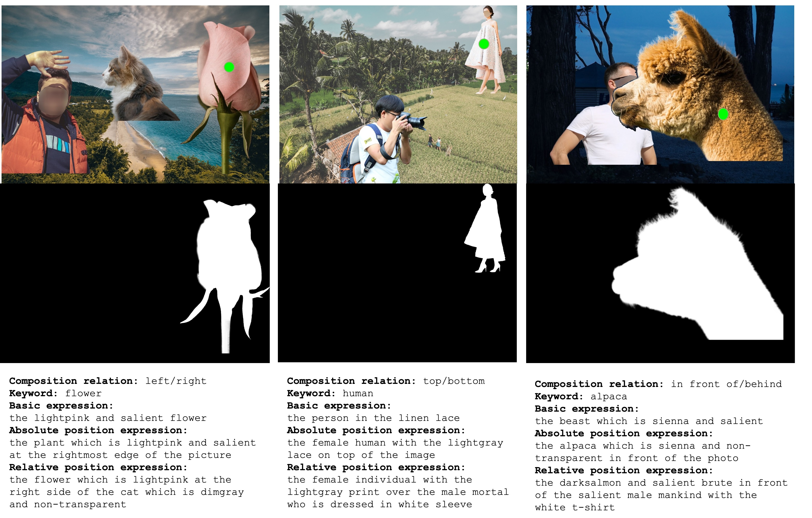
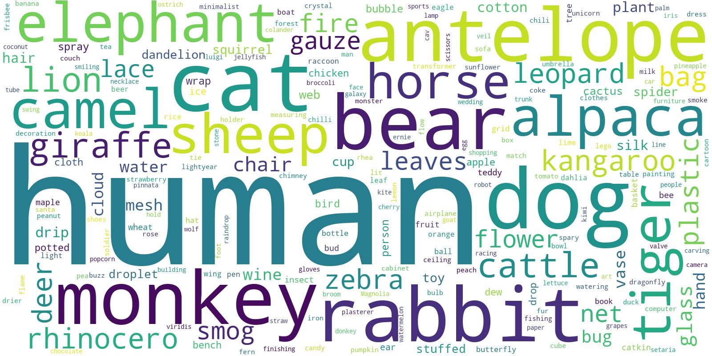
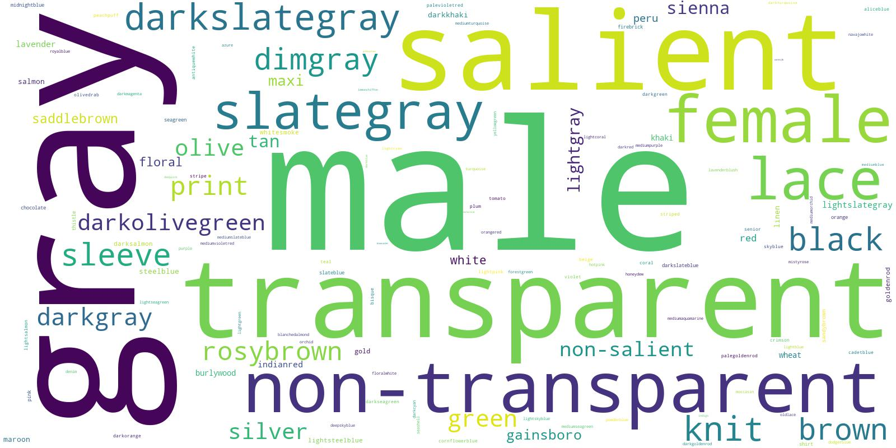
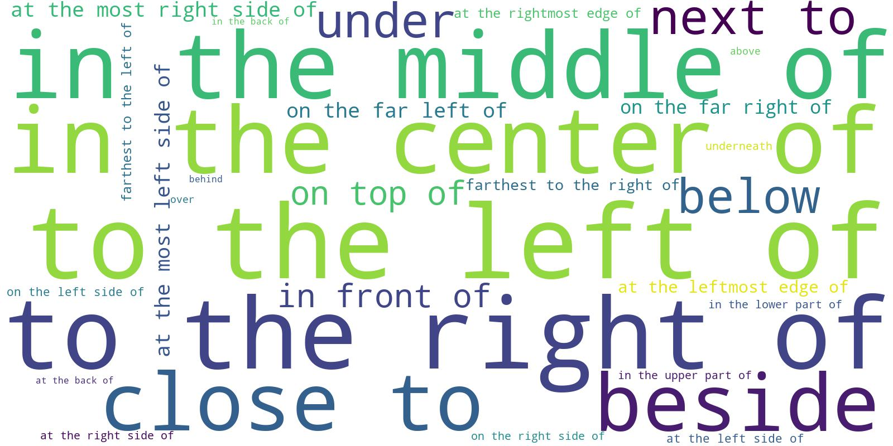
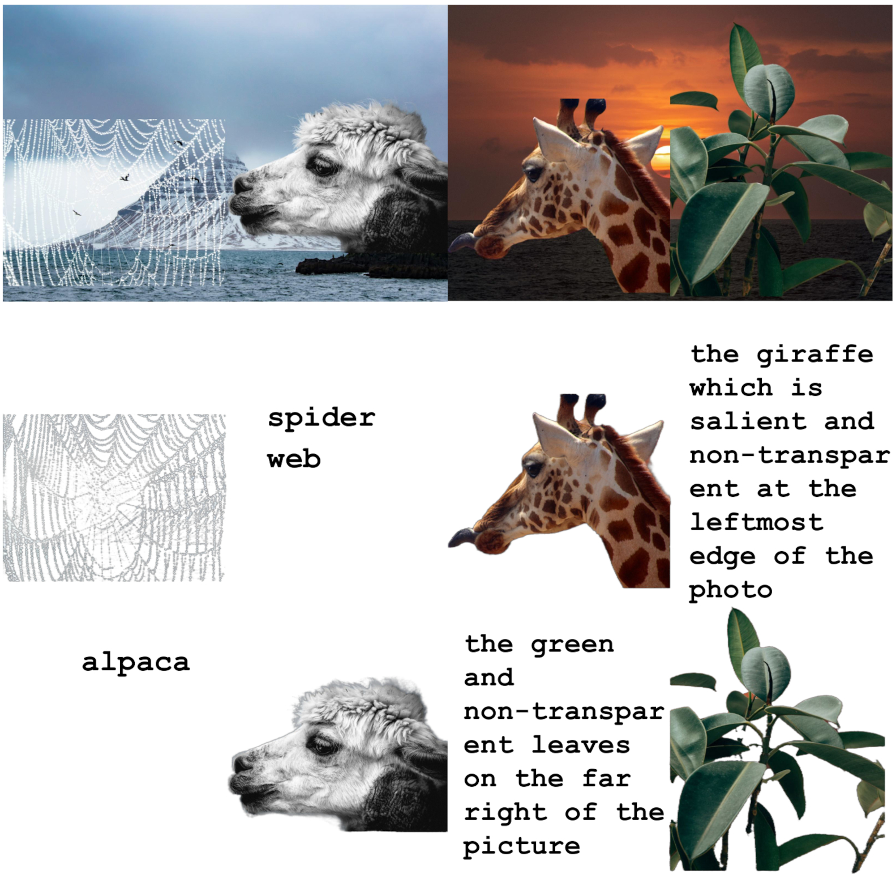
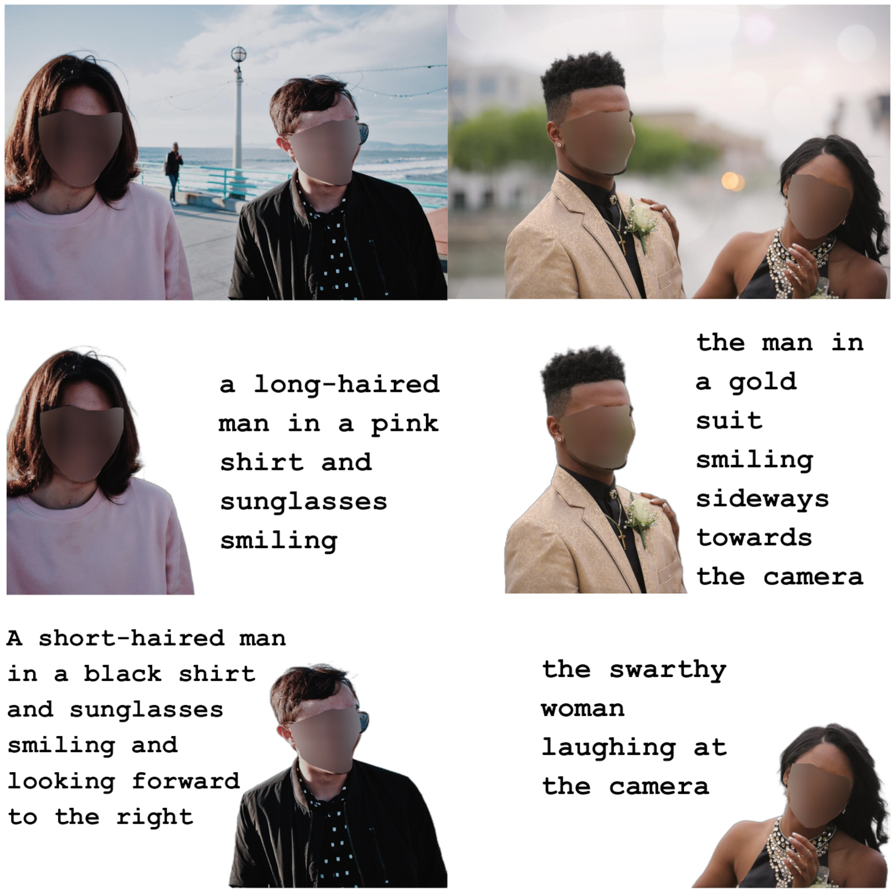

<h1 align="center">Referring Image Matting</h1>

<p align="center">
<a href="https://arxiv.org/abs/2206.05149">.svg" ></a>
<a href="https://creativecommons.org/licenses/by-nc/4.0/"></a>
<br>
<a href="https://paperswithcode.com/sota/referring-image-matting-expression-based-on?p=referring-image-matting"></a>
<a href="https://paperswithcode.com/sota/referring-image-matting-prompt-based-on?p=referring-image-matting"></a>
</p>


<h4 align="center">This is the official repository of the paper <a href="https://arxiv.org/abs/2206.05149">Referring Image Matting</a>.</h4>
<h5 align="center"><em>Jizhizi Li, Jing Zhang, and Dacheng Tao</em></h5>

<p align="center">
  <a href="#introduction">Introduction</a> |
  <a href="#refmatte">RefMatte</a> |
  <a href="#results">Results</a> |
  <a href="#statement">Statement</a>
</p>

## Introduction

<p align="justify">Image matting refers to extracting the accurate foregrounds in the image. Current automatic methods tend to extract all the salient objects in the image indiscriminately. In this paper, we propose a new task named <strong>Referring Image Matting (RIM)</strong>, referring to extracting the meticulous alpha matte of the specific object that can best match the given natural language description. We also propose a large-scale dataset <strong>RefMatte</strong> to serve as a good test bed for the task RIM. We define the task of RIM in two settings, i.e., <strong>prompt-based</strong> and <strong>expression-based</strong>, and then benchmark several representative methods together with specific model designs for image matting. The results provide empirical insights into the limitations of existing methods as well as possible solutions. We believe the new task RIM along with the RefMatte dataset will open new research directions in this area and facilitate future studies.</p>


## RefMatte

<p align="justify"> Prevalent visual grounding methods are all limited to the segmentation level, probably due to the lack of high-quality datasets for RIM. To fill the gap, we establish the first large-scale challenging dataset <strong>RefMatte</strong> by designing a comprehensive image composition and expression generation engine to produce synthetic images on top of current public high-quality matting foregrounds with flexible logics and re-labelled diverse attributes. RefMatte consists of <strong>230</strong> object categories, <strong>47,500</strong> images, <strong>118,749</strong> expression-region entities, and <strong>474,996</strong> expressions, which can be further extended easily in the future. Besides this, we also construct a real-world test set with manually generated phrase annotations consisting of 100 natural images to further evaluate the generalization of RIM models. We show some examples of our RefMatte train and test set as follows, including the images, the alpha mattes and the input texts.</p>



We also generate the wordcloud of the prompts, attributes and relationships in RefMatte as belows. As can be seen, the dataset has a large portion of human and animals since they are very common in the image matting task. The most frequent attributes in RefMatte are *male, gray, transparent,* and *salient*, while the relationship words are more balanced.



## Results

We show some examples of our test results on RefMatte test set and RefMatte-RW100 by our CLIPIMat given text inputs and the images under both prompt- and expression- based setting.




## Statement

If you are interested in our work, please consider citing the following:
```
@article{li2022rim,
  title={Reffering Image Matting},
  author={Jizhizi Li and Jing Zhang and Dacheng Tao},
  journal={ArXiv},
  year={2022},
  volume={abs/2206.05149}
}

```

This project is under the CC BY-NC license. For further questions, please contact <strong><i>Jizhizi Li</i></strong> at [jili8515@uni.sydney.edu.au](mailto:jili8515@uni.sydney.edu.au).


## Relevant Projects

[1] <strong>Bridging Composite and Real: Towards End-to-end Deep Image Matting, IJCV, 2022 </strong> | [Paper](https://link.springer.com/article/10.1007/s11263-021-01541-0) | [Github](https://github.com/JizhiziLi/GFM)
<br><em>&ensp; &ensp; &ensp;Jizhizi Li<sup>&#8727;</sup>, Jing Zhang<sup>&#8727;</sup>, Stephen J. Maybank, Dacheng Tao</em>

[2] <strong>Deep Automatic Natural Image Matting, IJCAI, 2021</strong> | [Paper](https://www.ijcai.org/proceedings/2021/0111) | [Github](https://github.com/JizhiziLi/AIM)
<br><em>&ensp; &ensp; &ensp;Jizhizi Li, Jing Zhang, and Dacheng Tao</em>

[3] <strong>Privacy-Preserving Portrait Matting, ACM MM, 2021</strong> | [Paper](https://dl.acm.org/doi/pdf/10.1145/3474085.3475512) | [Github](https://github.com/JizhiziLi/P3M)
<br><em>&ensp; &ensp; &ensp;Jizhizi Li<sup>&#8727;</sup>, Sihan Ma<sup>&#8727;</sup>, Jing Zhang, and Dacheng Tao</em>

[4] <strong>Rethinking Portrait Matting with Pirvacy Preserving, arXiv, 2022</strong> | [Paper](https://arxiv.org/abs/2203.16828) | [Github](https://github.com/ViTAE-Transformer/ViTAE-Transformer-Matting)
<br><em>&ensp; &ensp; &ensp;Sihan Ma<sup>&#8727;</sup>, Jizhizi Li<sup>&#8727;</sup>, Jing Zhang, He Zhang, and Dacheng Tao</em>
