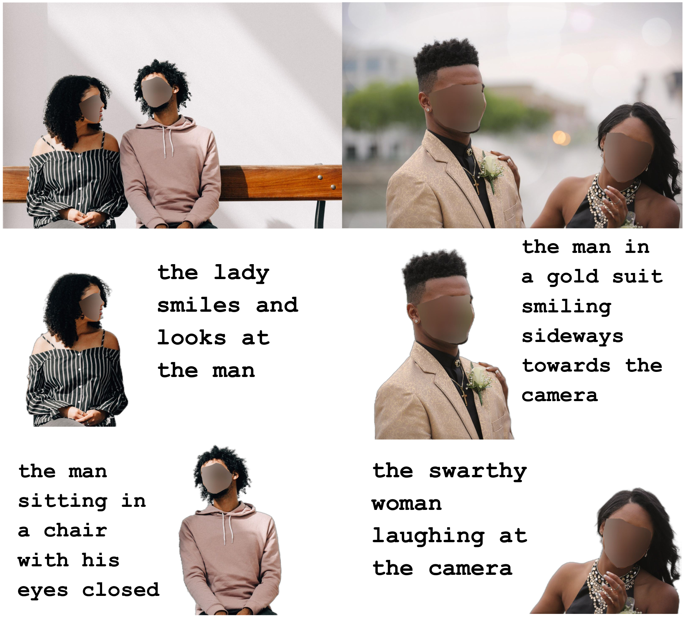

<h1 align="center">Referring Image Matting [CVPR-2023]</h1>

<p align="center">
<a href="https://arxiv.org/abs/2206.05149">.svg" ></a>
<a href="https://creativecommons.org/licenses/by-nc/4.0/"></a>
<br>
<a href="https://paperswithcode.com/sota/referring-image-matting-keyword-based-on?p=referring-image-matting"></a>
<br>
<a href="https://paperswithcode.com/sota/referring-image-matting-expression-based-on?p=referring-image-matting"></a>
<br>
<a href="https://paperswithcode.com/sota/referring-image-matting-refmatte-rw100-on?p=referring-image-matting"></a>
</p>


<h4 align="center">This is the official repository of the paper <a href="https://arxiv.org/abs/2206.05149">Referring Image Matting</a>.</h4>
<h5 align="center"><em>Jizhizi Li, Jing Zhang, and Dacheng Tao</em></h5>

<p align="center">
  <a href="#introduction">Introduction</a> |
  <a href="#refmatte-and-refmatte-rw100">RefMatte</a> |
  <a href="#clipmat">CLIPMat</a> |
  <a href="#results">Results</a> |
  <a href="#statement">Statement</a>
</p>


***
>
><h3><strong><i>🚀 News</i></strong></h3>
>
> [2023-04-17]: The datasets <a href="#refmatte-and-refmatte-rw100"><strong>RefMatte and RefMatte-RW100</strong></a> can now be <strong>openly accessed</strong> from the links below! Please follow the dataset release agreements to access.
>
> | Dataset | Dataset Link (One Drive)|Size| Dataset Release Agreement|
> | :----:| :----: | :----: |:----: | 
> |<strong>RefMatte</strong>|[Link](https://1drv.ms/u/s!AimBgYV7JjTlgcgVWgCGa3PbWgId9g?e=D4WQWD) (pw: 3ft9cb)|43.7G|[Agreement (CC BY-NC License)](https://jizhizili.github.io/files/rim_datasets_agreements/RefMatte_Dataset_Release_Agreement.pdf)| 
> |<strong>RefMatte-RW100</strong>|[Link](https://1drv.ms/u/s!AimBgYV7JjTlgcgUqr3qRhEgP_p6sQ?e=iFciZI) (pw: 3ft9cb)|66.6M|[Agreement (CC BY-NC License)](https://jizhizili.github.io/files/rim_datasets_agreements/RefMatte-RW100_Dataset_Release_Agreement.pdf)| 
>
> [2023-02-28]: The paper has been accepted by the  Computer Vision and Pattern Recognition Conference ([CVPR](https://cvpr2023.thecvf.com/))! 🎉
> 


## Introduction


<p align="justify">Image matting refers to extracting the accurate foregrounds in the image. Current automatic methods tend to extract all the salient objects in the image indiscriminately. In this paper, we propose a new task named <strong>Referring Image Matting (RIM)</strong>, referring to extracting the meticulous alpha matte of the specific object that can best match the given natural language description. We then propose a large-scale dataset <strong>RefMatte</strong> and a carefully designed method <strong>CLIPMat</strong> to serve as a baseline suite for RIM. We believe the new task RIM along with the RefMatte dataset and the method CLIPMat will open new research directions in this area and facilitate future studies. The dataset, code, and the method will be published soon.</p>


## RefMatte and RefMatte-RW100


<p align="justify"> Prevalent visual grounding methods are all limited to the segmentation level, probably due to the lack of high-quality datasets. To fill the gap, we establish the first large-scale challenging dataset <strong>RefMatte</strong> by designing a comprehensive image composition and expression generation engine to produce synthetic images on top of current public high-quality matting foregrounds with flexible logics and re-labelled diverse attributes. RefMatte consists of <strong>230</strong> object categories, <strong>47,500</strong> images, <strong>118,749</strong> expression-region entities, and <strong>474,996</strong> expressions, which can be further extended easily in the future. Besides this, we also construct a real-world test set RefMatte-RW100 with manually generated phrase annotations consisting of 100 natural images to further evaluate the generalization of RIM models. We show some examples of RefMatte as follows, including the images, the alpha mattes and the input texts. More can be seen from this <a href="https://github.com/JizhiziLi/RIM/tree/master/demo#more-examples-of-refmatte">page</a>. We have released the dataset RefMatte and RefMatte-RW100, please follow the dataset release agreements to access.</p> 


| Dataset | Dataset Link (One Drive)| Size | Dataset Release Agreement|
| :----:| :----: | :----: |  :----: | 
|<strong>RefMatte</strong>|[Link](https://1drv.ms/u/s!AimBgYV7JjTlgcgVWgCGa3PbWgId9g?e=D4WQWD) (pw: 3ft9cb)|43.7G|[Agreement (CC BY-NC License)](https://jizhizili.github.io/files/rim_datasets_agreements/RefMatte_Dataset_Release_Agreement.pdf)| 
|<strong>RefMatte-RW100</strong>|[Link](https://1drv.ms/u/s!AimBgYV7JjTlgcgUqr3qRhEgP_p6sQ?e=iFciZI) (pw: 3ft9cb)|66.6M|[Agreement (CC BY-NC License)](https://jizhizili.github.io/files/rim_datasets_agreements/RefMatte-RW100_Dataset_Release_Agreement.pdf)| 


We also generate the wordcloud of the keywords, attributes and relationships in RefMatte as belows. As can be seen, the dataset has a large portion of human and animals since they are very common in the image matting task. The most frequent attributes in RefMatte are *male, gray, transparent,* and *salient*, while the relationship words are more balanced.


## CLIPMat

<p align="justify">Furthermore, we present a novel baseline method </strong>CLIPMat</strong> for RIM, including a context-embedded prompt, a text-driven semantic pop-up, and a multi-level details extractor. Extensive experiments on RefMatte in both keyword and expression settings validate the superiority of CLIPMat over representative methods. We show the diagram as follows, while more information can be viewed from the paper.</p>


## Results

<p align="justify">We show some examples of our test results on RefMatte test set and RefMatte-RW100 by our CLIPMat given text inputs and the images under both keyword-based and expression-based setting. More can be seen from this <a href="https://github.com/JizhiziLi/RIM/tree/master/demo#more-results-of-clipmat">page</a>.</p>




## Statement

If you are interested in our work, please consider citing the following:
```
@inproceedings{rim,
  title={Referring Image Matting},
  author={Li, Jizhizi and Zhang, Jing and Tao, Dacheng},
  booktitle={Proceedings of the IEEE Computer Vision and Pattern Recognition},
  year={2023}
}
```

This project is under the CC BY-NC license. For further questions, please contact <strong><i>Jizhizi Li</i></strong> at [jili8515@uni.sydney.edu.au](mailto:jili8515@uni.sydney.edu.au).


## Relevant Projects

<a href="https://github.com/ViTAE-Transformer/ViTAE-Transformer-Matting"></a>
</p>

[1] <strong>Deep Automatic Natural Image Matting, IJCAI, 2021</strong> | [Paper](https://www.ijcai.org/proceedings/2021/0111) | [Github](https://github.com/JizhiziLi/AIM)
<br><em>&ensp; &ensp; &ensp;Jizhizi Li, Jing Zhang, and Dacheng Tao</em>

[2] <strong>Privacy-Preserving Portrait Matting, ACM MM, 2021</strong> | [Paper](https://dl.acm.org/doi/pdf/10.1145/3474085.3475512) | [Github](https://github.com/JizhiziLi/P3M)
<br><em>&ensp; &ensp; &ensp;Jizhizi Li<sup>&#8727;</sup>, Sihan Ma<sup>&#8727;</sup>, Jing Zhang, and Dacheng Tao</em>

[3] <strong>Bridging Composite and Real: Towards End-to-end Deep Image Matting, IJCV, 2022 </strong> | [Paper](https://link.springer.com/article/10.1007/s11263-021-01541-0) | [Github](https://github.com/JizhiziLi/GFM)
<br><em>&ensp; &ensp; &ensp;Jizhizi Li<sup>&#8727;</sup>, Jing Zhang<sup>&#8727;</sup>, Stephen J. Maybank, and Dacheng Tao</em>

[4] <strong>Rethinking Portrait Matting with Privacy Preserving, IJCV, 2023</strong> | [Paper](https://arxiv.org/pdf/2203.16828.pdf) | [Github](https://github.com/ViTAE-Transformer/P3M-Net)
<br><em>&ensp; &ensp; &ensp;Sihan Ma<sup>&#8727;</sup>, Jizhizi Li<sup>&#8727;</sup>, Jing Zhang, He Zhang, and Dacheng Tao</em>

[5] <strong>Deep Image Matting: A Comprehensive Survey, ArXiv, 2023</strong> | [Paper](https://arxiv.org/abs/2304.04672) | [Github](https://github.com/jizhiziLi/matting-survey)
<br><em>&ensp; &ensp; &ensp;Jizhizi Li, Jing Zhang, and Dacheng Tao</em>